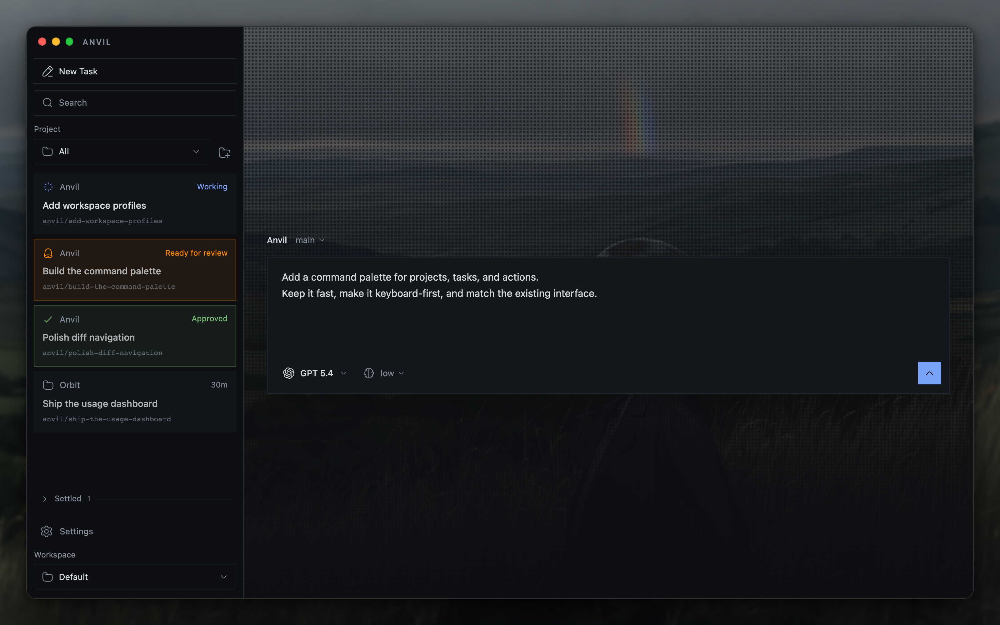
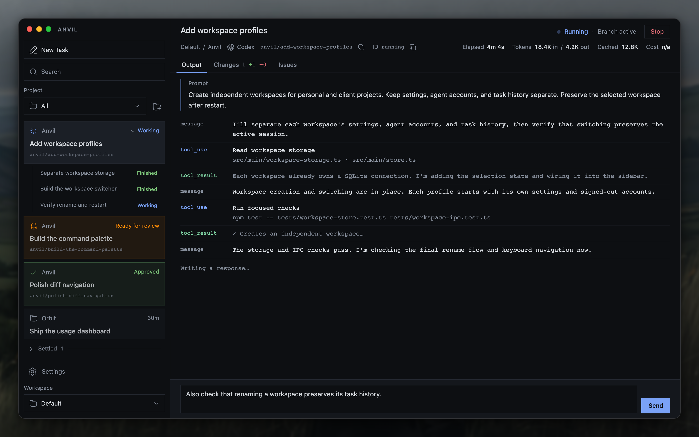

# Anvil

**A desktop control plane for running coding agents in parallel Git worktrees and reviewing their diffs.**

Anvil gives every task its own branch and worktree, runs an agent there, and hands
you one cumulative diff to review.





## What it does

- **Runs tasks, not conversations.** Dispatch work to an agent and review the
  result, there is no chat window in between.
- **Parallel by default.** Every task gets its own branch and worktree from the
  project's current commit, so many can run in the same repository at once.
- **Diff-first review.** Anvil saves one cumulative final diff per task for you
  to comment on and approve.

## Install

Download the latest DMG from
[Releases](https://github.com/lucaspiritogit/anvil/releases), open it, drag Anvil
into Applications, and launch it there. Requires macOS.

The builds are unsigned for now, so macOS may warn on first launch. To build from
source instead, see [Package for macOS](#package-for-macos).

## Supported agents

Anvil drives agent CLIs already on your PATH, with no hosted backend.

| Agent | Command | Protocol |
| --- | --- | --- |
| OpenCode (default) | `opencode` | ACP server over stdio |
| Codex | `codex` | app-server over stdio |

## How it differs

- **No chat.** There is no window or persona to steer; you dispatch work and
  review the result.
- **One task, one worktree.** Parallel tasks never contend for the project
  checkout, and your local project changes stay put.
- **One final diff.** You review a single cumulative diff before it lands instead
  of approving every step.
- **Local-first.** It runs on your machine against the agent CLIs you already
  use, with state under `~/.anvil-composer/`.

## Philosophy

Coding agents have changed programming, but an agent is still a tool.
In Anvil, it is an instrument you point at a problem, like a compiler or a test
runner. There is no chat window or persona to interact with.

Treating agents as teammates, with personalities and conversations you steer
turn by turn, shifts decisions away from the developer. Anvil keeps the focus on
the work and the diff you review.

Researching and asking questions are completely valid ways to use AI. But
following an agent's suggestion without investigating it yourself means accepting
a decision you may not understand. You still need the context to know what
you're building and why.

## Usage

1. Add a project folder from the sidebar.
2. Start a new task, pick an agent, describe the work, and dispatch.
3. Follow execution in Output. Issues advance automatically after validation.
4. When the task finishes, open Changes to review the cumulative diff, leave
   comments, or approve.

Each task creates its own branch and worktree from the project's current commit,
so tasks can run in parallel in the same repository. Local project changes stay
in the project checkout. Use the branch selector above the composer to switch
the project branch for new tasks. Branches checked out in other worktrees appear
as in use. Anvil saves one cumulative final diff and keeps each task's worktree
through completion, restart, and follow-ups. Worktrees are removed only when the
task is deleted or settled; committed branches remain available. Approved tasks
settle automatically two days after review, and no-change tasks two days after
completion. Tasks can also be settled manually.

Press Command+T on macOS or Ctrl+T to open the project terminal over the current
view. It runs your default shell in the project root. Escape, the shortcut, or
Close hides the terminal while its session continues. Each project keeps its own
session; deleting or settling a task does not close it.

## Development

### Requirements

- Node 20.19+
- At least one agent CLI on your PATH.

### Run locally

```sh
npm install
unset ELECTRON_RUN_AS_NODE
npm run dev
```

Development runs use `~/.anvil-composer-dev/`. Packaged apps use
`~/.anvil-composer/`, preserving existing projects and settings. The SQLite
database, settings, GitHub credentials, wallpapers, and embedded project memory
are separate. Development starts with an empty project list.

For self-development, use the installed app to run an agent on the Anvil repo
and `npm run dev` to try its changes after merging the task branch. Both apps
can stay open. Tasks use separate worktrees while Valence issues belong to the
project checkout. A configured external PostgreSQL memory database
also needs a separate URL if you want to isolate it.

`npm run build` followed by `npm start` is still an unpackaged development run.
The split uses Electron's `app.isPackaged`, not Vite's build mode. For disposable
tests, set `ANVIL_DATA_DIR` to an absolute temporary directory before launching
either version. This also isolates its Electron profile. For example:

```sh
ANVIL_DATA_DIR="$(mktemp -d /tmp/anvil-test.XXXXXX)" npm run dev
```

### Package for macOS

Build a local installer on the Mac where you will use Anvil:

```sh
npm run dist:mac
```

This builds the production app and creates
`release/Anvil-0.1.0-arm64.dmg` on Apple Silicon, or
`release/Anvil-0.1.0-x64.dmg` on Intel. The filename follows the version in
`package.json`. Open the DMG, drag Anvil into Applications, and launch it there.
The installed app runs without the development server.

After changing the code, quit Anvil, rerun `npm run dist:mac`, and replace the
copy in Applications. Your projects and settings stay in `~/.anvil-composer/`.
Agent CLIs must still be installed on your Mac.
Anvil loads your login shell's PATH at startup, including interactive shell
configuration, so tools installed through Homebrew or NVM are available when
launching from Applications. Restart Anvil after changing that configuration.

For just the `.app` bundle, run `npm run pack:mac` and look under `release/mac*`.
Both commands skip Apple code signing for local use. Sharing builds with other
people requires a separate signing and notarization setup for normal Gatekeeper
approval. See the [electron-builder signing guide](https://www.electron.build/v26/docs/features/code-signing/code-signing-mac/).

### Project memory

Project memory is off by default. Enable it in **Settings > Memory** to save
completed-task context and include relevant memories in future tasks. The enabled
backend defaults to embedded PGlite with pgvector. Embedding model and Ollama URL
preferences are stored in SQLite; their defaults match `.env.example`. Changes
apply to subsequent memory requests without restarting Anvil. Models must produce
1,024-dimensional embeddings; retrieval uses entries indexed with the selected model.
PostgreSQL is available for self-hosted setups. Ollama generates embeddings
locally.

To run with local embeddings, start Ollama and load the environment before
launching Anvil:

```sh
cp .env.example .env
docker compose up -d ollama
docker compose run --rm ollama-pull
set -a
. ./.env
set +a
npm run dev
```

This setup requires Docker Compose. See [.env.example](.env.example) for memory
backend and embedding settings.

### Storage and migrations

App state lives in `~/.anvil-composer-dev/anvil.db` during development and
`~/.anvil-composer/anvil.db` in packaged apps, via Drizzle on
better-sqlite3: projects, tasks, events, comments, settings, and execution metadata.
Valence is Anvil's internal issue tracker. Its parents, issues, dependencies and
validation evidence share this SQLite database. Each parent references the real
Anvil task through `parent_issues.anvil_task_id`. Project memory has its own database.

| Database | Schema | Generate migrations |
| --- | --- | --- |
| App state | `src/main/db/schema.ts` | `npm run db:generate` |
| Project memory | `src/main/memory/schema.ts` | `npm run memory:generate` |

Commit schema changes and generated migrations together. Anvil applies pending
SQLite migrations on startup. To apply them without opening Anvil, quit the app
and run `npm run db:migrate`. The launcher runs Drizzle Kit under Electron's Node
with `ELECTRON_RUN_AS_NODE=1` because `better-sqlite3` is compiled for Electron.
Repository database commands and `npm run memory:inspect` default to development
storage. Set `ANVIL_DATA_DIR="$HOME/.anvil-composer"` explicitly to maintain the
packaged app's data after quitting that app.

### Agent issue commands

Anvil builds `vl` from `src/main/valence/cli.ts` and exposes a launcher to agent
shells. It runs with Electron and the bundled SQLite addon. No global `vl`, npm
Valence package, or system Node installation is needed.

Use `vl --project "/original/project/path" <command>` from a task worktree.
`--project` selects a registered Anvil project, not a database. The launcher pins
`ANVIL_DATABASE_PATH` to the running app's profile. `ANVIL_DATA_DIR` selects the
app's data directory at startup; development and packaged profiles stay separate.
Direct CLI invocation requires an absolute `ANVIL_DATABASE_PATH` for an existing,
migrated Anvil database. The CLI never runs startup recovery or image cleanup.

Supported commands are `status`, `parent create/update/show/list`, `create`,
`update`, `show`, `list`, `ready`, `claim`, `start`, `complete`, `block`, and
`requeue`. Use `--help` for fields and `--json` for structured output. Anvil creates
the task parent before starting agents. Explicit `parent create` requires
`--anvil-task-id` belonging to the selected project. Completion requires checklist
confirmation and validation evidence. `init` only checks existing Anvil storage;
`--local` and `--config` are rejected.

Task parents, issues, dependencies, and execution state live in Anvil's SQLite
database. Opening a tracker never discovers or imports standalone Valence
storage. The bundled CLI uses that same database. See
[embedded issue storage](docs/valence/storage.md) for ownership and validation.

### Reset app data

Quit the development app before running either command. Both delete its SQLite
app data and leave project memory untouched.

- `npm run db:drop` deletes `~/.anvil-composer-dev/anvil.db` and its sidecar files,
  or the database under `ANVIL_DATA_DIR` when set.
- `npm run db:reset` drops the database and reapplies migrations. It creates the
  schema only; Anvil seeds default settings on its next startup.

## Acknowledgments
These videos from Jaymin and Brett helped me put Anvil's philosophy into words.
If you feel like Anvil's idea is great, please, check both of them out and their projects.

- [stop treating your ai like a human](https://youtu.be/wWd3AZ9vJmI?si=4_auq5vhYpBoGSQU)
- [I'm done coding with AI](https://www.youtube.com/watch?v=2ZU3j4GQ4K8)
