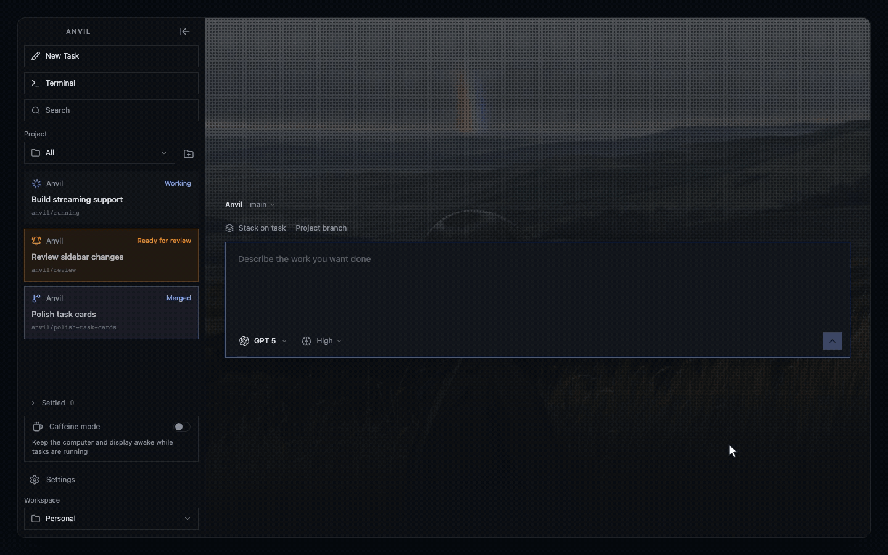

# Anvil

**A local-first control plane that runs coding agents in parallel Git worktrees and lets you review their diffs from your desktop or browser.**




Run Anvil as a desktop app or a standalone server. Use the same interface on the host machine, over a trusted LAN, or through Tailscale HTTPS.

## What it does

- **Runs tasks, not conversations.** Give an agent a job, follow the run when you
  want, and return when there is code or a decision waiting.
- **Keeps parallel work isolated.** Every task gets its own Git branch and
  worktree, so agents never collide with your checkout or each other.
- **Stacks dependent tasks.** Queue follow-up work as a chain. Each task waits
  for its parent to finish, then starts from the delivered result.
- **Shows you what is happening.** Follow live output, task status, issues,
  elapsed time, context usage, tokens, and cost.
- **Puts the diff first.** Review one cumulative diff, comment on exact lines,
  request changes, merge the branch, or open a pull request.
- **Separates your workspaces.** Each workspace keeps its own projects, agent
  accounts, credentials, task history, settings, and project memory.
- **Runs locally, opens anywhere.** Agents, repositories, and data stay on the
  host machine. Use Anvil from its desktop app or connect through a browser over
  your LAN or Tailscale.
- **Makes each workspace recognizable.** Choose a color or import an image for
  the project background.

## Install

Download the latest DMG from
[Releases](https://github.com/lucaspiritogit/anvil/releases), open it, drag Anvil
into Applications, and launch it there.

The builds are unsigned for now, so your OS may warn on first launch. I recommend building from source first until i get signing going.

## Supported agents

Anvil drives agent CLIs already on your PATH, with no hosted backend.

- Opencode (default): Through ACP server over stdio
- Codex: Throguh the codex app-server implementation over stdio

## Development

### Requirements

- Node 24.15+
- At least one agent CLI on your PATH.

### Run locally

```sh
npm install
unset ELECTRON_RUN_AS_NODE
npm run dev
```

Development runs use `~/.anvil-composer-dev/`. Packaged apps use
`~/.anvil-composer/`, preserving existing projects and settings. The SQLite
database, settings, GitHub credentials, wallpapers, and embedded project memory
are separate. Development starts with an empty project list.

For self-development, use the installed app to run an agent on the Anvil repo
and `npm run dev` to try its changes after merging the task branch. Both apps
can stay open. Tasks use separate worktrees while Valence issues belong to the
project checkout. A configured external PostgreSQL memory database
also needs a separate URL if you want to isolate it.

`npm run build` followed by `npm start` is still an unpackaged development run.
The split uses Electron's `app.isPackaged`, not Vite's build mode. For disposable
tests, set `ANVIL_DATA_DIR` to an absolute temporary directory before launching
either version. This also isolates its Electron profile. For example:

```sh
ANVIL_DATA_DIR="$(mktemp -d /tmp/anvil-test.XXXXXX)" npm run dev
```

## Server and remote access

The server runs agents, Git worktrees, storage, and the browser interface on the
host machine. Remote devices only need a browser.

| Mode | Start | Access |
| --- | --- | --- |
| Desktop | Launch Anvil, then open **Settings > Connections** | Local by default, with optional LAN or Tailscale access |
| Headless local | `npm run serve` | `http://127.0.0.1:4780`, without authentication |
| Headless LAN | `npm run serve:lan` | `http://host:4780` with username `anvil` and your server password |
| Headless Tailscale | `npm run serve:tailscale` | Private HTTPS address managed by Tailscale |

GitHub releases also include self-contained `Anvil-server-*` archives. They
include Node.js, native dependencies, the browser UI, and database migrations,
so the server machine does not need Node.js or build tools installed. Extract
the archive and run:

```sh
./anvil-server
./anvil-server --lan
./anvil-server --tailscale
```

On Windows, use `anvil-server.cmd`.

For desktop LAN access, set a server password in **Settings > Connections** and
enable **Allow other devices**. Anvil stores only an Argon2id password hash.
Open `http://host:4780` from another device on the same trusted network and sign
in with username `anvil`.

Enable **Tailscale HTTPS** to access the desktop server from another network.
Install and connect Tailscale on both devices, then open the HTTPS address shown
by Anvil. Desktop Tailscale access still requires the Anvil username and password.

For an unattended headless LAN server, provide the password through a file:

```sh
ANVIL_SERVER_PASSWORD_FILE=/absolute/path/to/password npm run serve:lan
```

Without a password file, the first terminal launch prompts for a password. The
headless Tailscale command delegates access control to Tailscale and does not read
the password file.

LAN mode uses HTTP, so use it only on a trusted network. Use Tailscale for private
HTTPS access outside that network.

## Philosophy

Coding agents have changed programming, but an agent is still a tool.
In Anvil, it is an instrument you point at a problem, like a compiler or a test
runner. There is no chat window or persona to interact with.

Treating agents as teammates, with personalities and conversations you steer
turn by turn, shifts decisions away from the developer. Anvil keeps the focus on
the work and the diff you review.

Researching and asking questions are completely valid ways to use AI. But
following an agent's suggestion without investigating it yourself means accepting
a decision you may not understand. You still need the context to know what
you're building and why.

## Usage

1. Add a project folder from the sidebar.
2. Start a new task, pick an agent, describe the work, and dispatch.
3. Follow execution in Output. Issues advance automatically after validation.
4. When the task finishes, open Changes to review the cumulative diff, leave
   comments, or approve.

Each task creates its own branch and worktree from the project's current commit,
so tasks can run in parallel in the same repository. Local project changes stay
in the project checkout. Use the branch selector above the composer to switch
the project branch for new tasks. Branches checked out in other worktrees appear
as in use. Anvil saves one cumulative final diff and keeps each task's worktree
through completion, restart, and follow-ups. Worktrees are removed only when the
task is deleted or settled; committed branches remain available. Approved tasks
settle automatically two days after review, and no-change tasks two days after
completion. Tasks can also be settled manually.

### Project memory

Project memory is off by default. Enable it in **Settings > Memory** to save
completed-task context and include relevant memories in future tasks. The enabled
backend defaults to embedded PGlite with pgvector. Embedding model and Ollama URL
preferences are stored in SQLite; their defaults match `.env.example`. Changes
apply to subsequent memory requests without restarting Anvil. Models must produce
1,024-dimensional embeddings; retrieval uses entries indexed with the selected model.
PostgreSQL is available for self-hosted setups. Ollama generates embeddings
locally.

To run with local embeddings, start Ollama and load the environment before
launching Anvil:

```sh
cp .env.example .env
docker compose up -d ollama
docker compose run --rm ollama-pull
set -a
. ./.env
set +a
npm run dev
```

This setup requires Docker Compose. See [.env.example](.env.example) for memory
backend and embedding settings.

### Storage and migrations

App state lives in `~/.anvil-composer-dev/workspaces/<name>/anvil.db` during development and
`~/.anvil-composer/workspaces/<name>/anvil.db` in packaged apps, via Drizzle on
Node's built-in SQLite driver: projects, tasks, events, comments, settings, and execution metadata.
Valence is Anvil's internal issue tracker. Its parents, issues, dependencies and
validation evidence share this SQLite database. Each parent references the real
Anvil task through `parent_issues.anvil_task_id`. Project memory has its own database.

| Database | Schema | Generate migrations |
| --- | --- | --- |
| App state | `src/server/db/schema.ts` | `npm run db:generate` |
| Project memory | `src/server/memory/schema.ts` | `npm run memory:generate` |

Commit schema changes and generated migrations together. Anvil applies pending
SQLite migrations on startup. To apply them without opening Anvil, quit the app
and run `npm run db:migrate`.
Repository database commands and `npm run memory:inspect` follow the selected
workspace in development storage. They share `scripts/maintenance.cjs`; PGlite
inspection reads that workspace's `memory/pglite` directory. Set `ANVIL_DATA_DIR="$HOME/.anvil-composer"` explicitly to maintain the
packaged app's data after quitting that app.

### Reset app data

Quit the development app before running either command. Both delete its SQLite
app data and leave project memory untouched.

- `npm run db:drop` deletes `~/.anvil-composer-dev/workspaces/<name>/anvil.db` and its sidecar files,
  or the database under `ANVIL_DATA_DIR` when set.
- `npm run db:reset` drops the database and reapplies migrations. It creates the
  schema only; Anvil seeds default settings on its next startup.

## Acknowledgments
These videos from Jaymin and Brett helped me put Anvil's philosophy into words.
If you feel like Anvil's idea is great, please, check both of them out and their projects.

- [stop treating your ai like a human](https://youtu.be/wWd3AZ9vJmI?si=4_auq5vhYpBoGSQU)
- [I'm done coding with AI](https://www.youtube.com/watch?v=2ZU3j4GQ4K8)